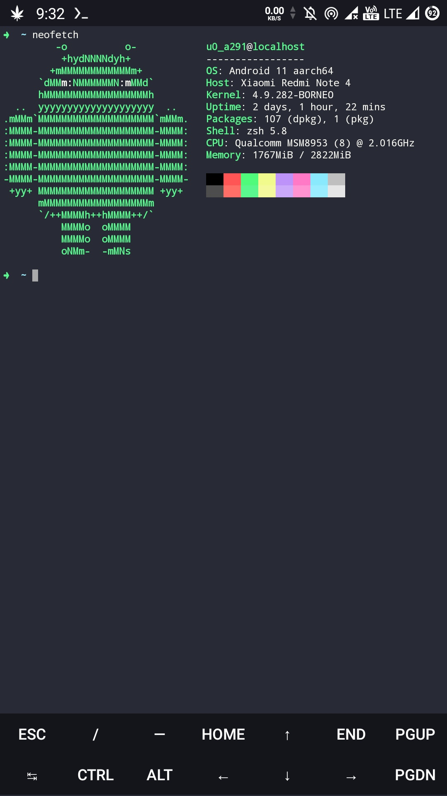
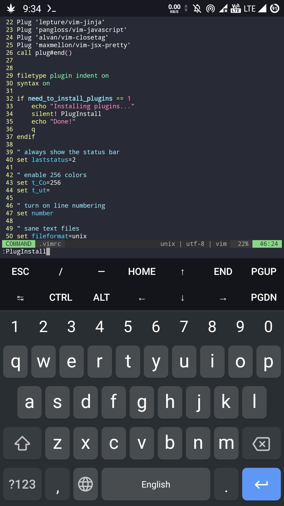
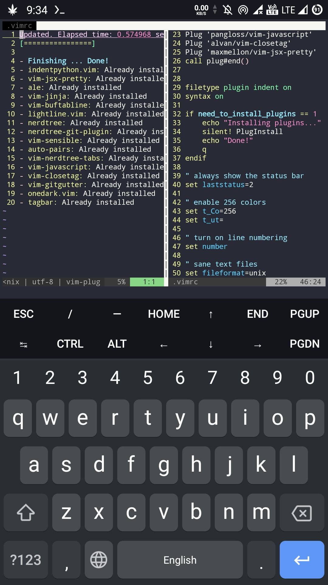
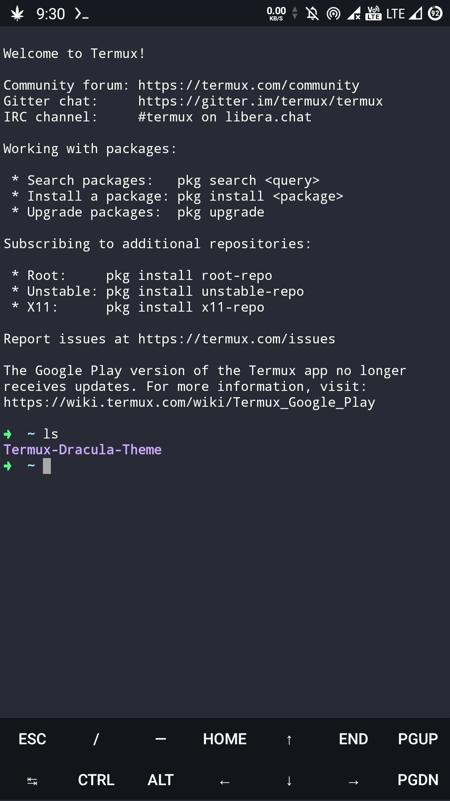

# #Hola, Soy S8m6n2o7a Mucho Gusto


## #Termux Dracula Theme
### #This repo is only change your termux normal theme into Dracula theme

## #Termux


## #Vim



## #Zsh


## #Automatizar

```
git clone https://github.com/S8m6n2o7a/Termux-Dracula-Theme.git && cd Termux-Dracula-Theme && python3 install.py
```


## #Manual
```
git clone https://github.com/S8m6n2o7a/Termux-Dracula-Theme.git
cd Termux-Dracula-Theme
python3 install.py
```

# #Nota importante
## This repo has an bug, When this Script is running then you will enterd into *zsh* shell then just simply exit from the *zsh* shell typing *exit* or press *ctrl + z / crtl + c/ ctrl + d* the Script will run Automatically

## #Requirements
### This is a python installer so, you just need  *Python*


# #Creditos

- Dracula Original Site [Dracula](https://draculatheme.com/)

- Vim Plugin manager [Vim](https://github.com/junegunn/vim-plug)

- .vimrc Script from [.vimrc](https://gist.github.com/miguelgrinberg/527bb5a400791f89b3c4da4bd61222e4)


# #Gracias Por Su Visita

